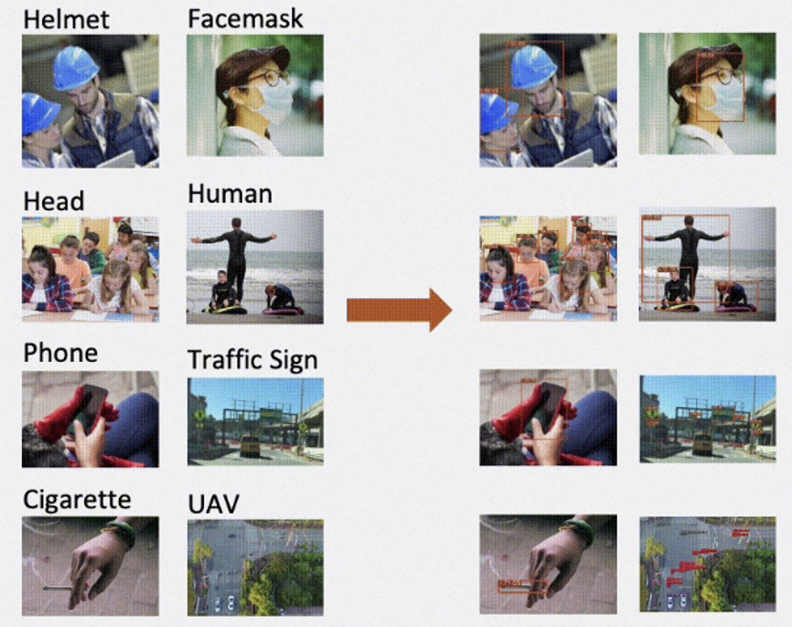
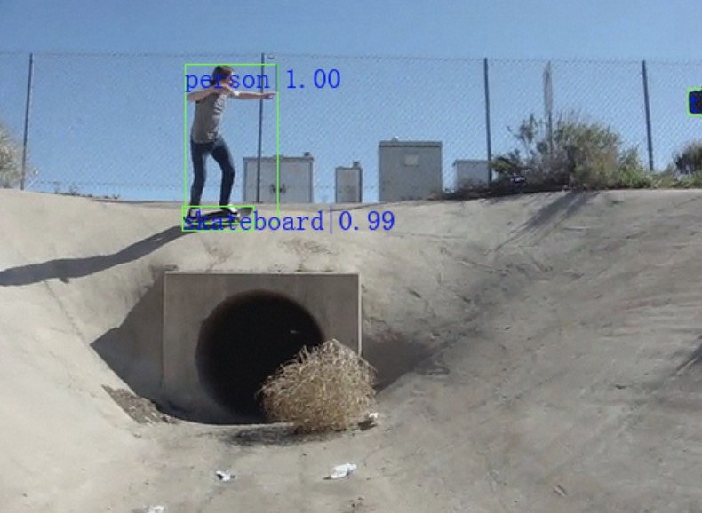
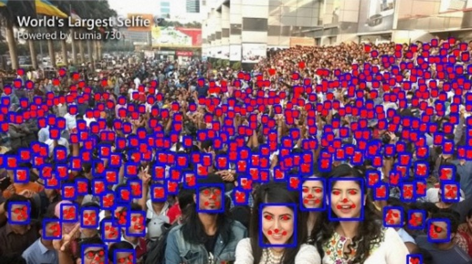
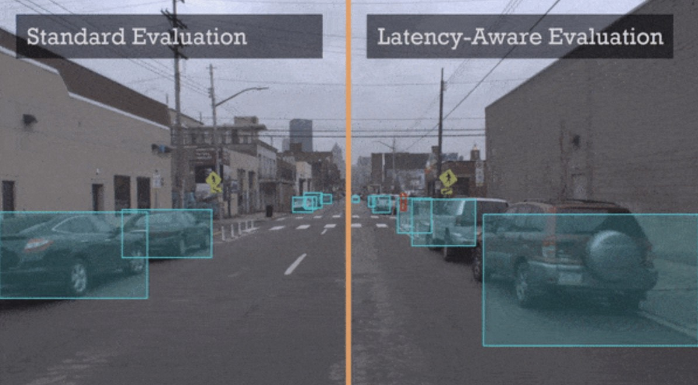
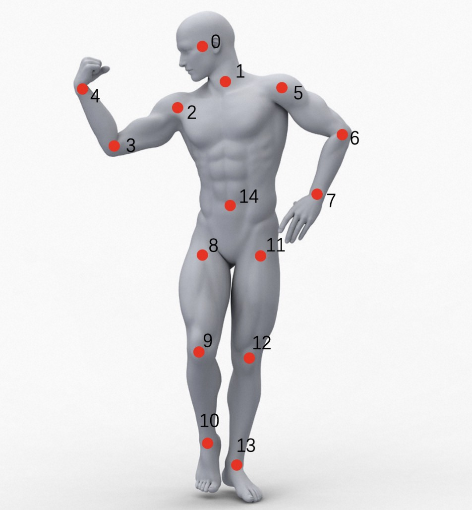
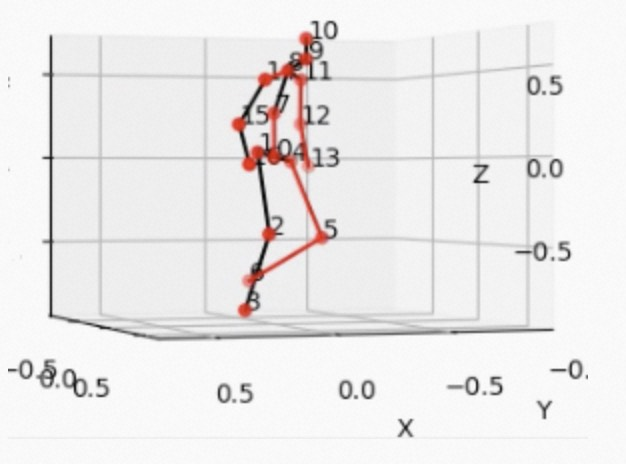
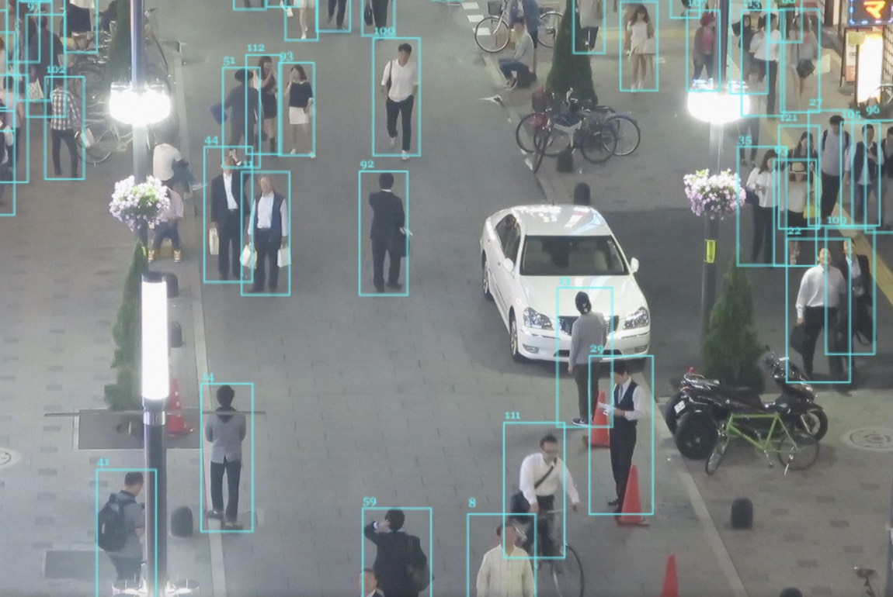
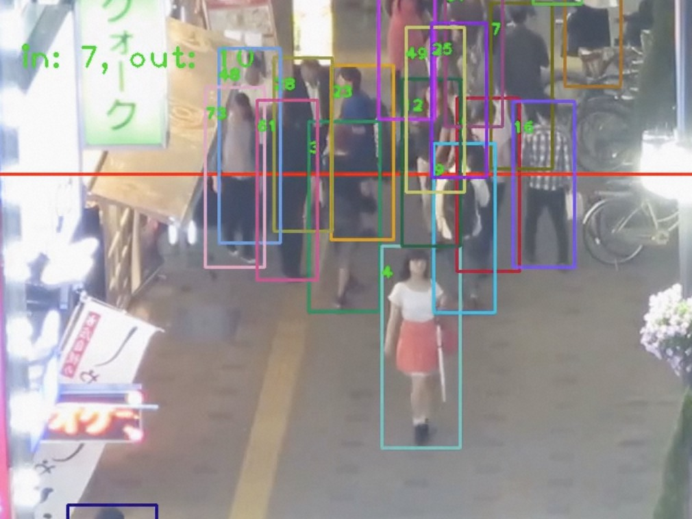
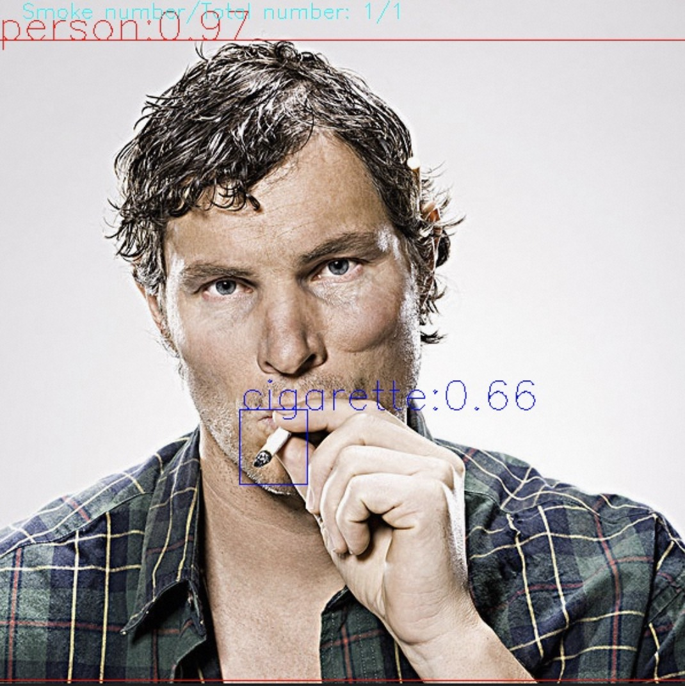
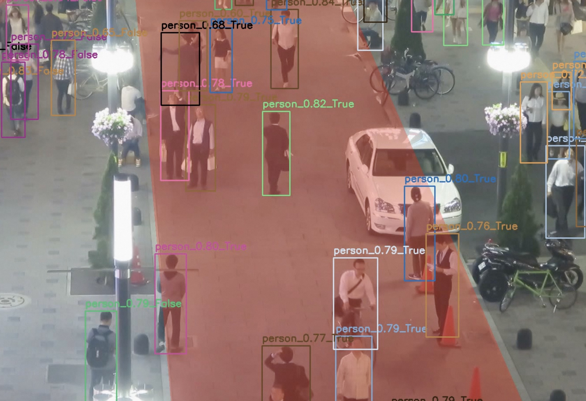

简体中文 | [English](README_EN.md)

# **AdaDet: A Development Toolkit for Object Detection based on [ModelScope](https://modelscope.cn/home)**

[](https://github.com/modelscope/adadet/blob/master/LICENSE)
[](https://github.com/modelscope/AdaDet/issues)
[](https://github.com/modelscope/AdaDet/stargazers)
[](./CONTRIBUTING.md)
## 🌈简介

AdaDet是基于[ModelScope](https://modelscope.cn/home)的一站式检测应用开发工具库，进行简单的环境配置后，可一行命令跑通众多前沿算法模型和场景化解决方案。

## 🎁支持的算法模型和场景化解决方案

|[通用目标检测](./docs/models/object_detection.md)|[垂类目标检测](./docs/models/domain_specific_object_detection.md)|[长尾/小目标检测](./docs/models/small_object_detection.md)|
|:---:|:---:|:---:|
| | | |
|[人脸检测](./docs/models/face_detection.md)|[OCR检测](./docs/models/ocr_detection.md)|[视频目标检测](./docs/models/video_object_detection.md)|
| | | |
|[2D关键点检测](./docs/models/2d_keypoints.md)|[3D关键点检测](./docs/models/3d_keypoints.md)|[视频目标跟踪](./docs/models/video_object_tracking.md)|
| | | |
| [人流计数](./docs/deploy/human/mot_counting_deploy.md) | [抽烟检测](./docs/deploy/security/smoke_det_deploy.md) | [闯入检测](./docs/deploy/human/break_in_deploy.md) |
| | | |
|[美颜滤镜](./docs/deploy/human/face_retouch_deploy.md)|||
||||

## 🔑算法库主要特性

### 🎈开箱即用
非常简单高效的体验方式，通过配置文件和脚本能够一键跑通定义好的场景化解决方案和配套的模型，降低开发者的开发门槛，大大提升使用效率。

### 🎈丰富的模型库
AdaDet支持大量学术界和工业界领先模型，涵盖目标检测跟踪、关键点检测等一系列模型。

## 🍗最近更新
2023.03.31 AdaDet 1.0版本发布！

## 🔧环境安装
环境安装配置详见[安装文档](./docs/install.md)。

## ⚡️快速开始
[快速开始教程](./docs/quick_start.md)

## ⏩主要功能快速体验

### 📍场景化解决方案
场景化解决方案是面向产业界的落地应用，每个场景化解决方案可能包含若干模型节点和业务业务节点，帮助开发者快速开发和体验不同产业的落地应用。
#### 📌效果体验
可通过[run_deploy.sh](./tools/run_deploy.sh)脚本快速体验场景化解决方案。
```bash
sh tools/run_deploy.sh
```
可点击[创空间](https://modelscope.cn/studios/jp_lan/cv_maasdet_test/summary)体验场景化解决方案demo。

当前支持的场景化解决方案详细介绍见相关文档链接：
- [人流计数](./docs/deploy/human/mot_counting_deploy.md)
- [闯入检测](./docs/deploy/human/break_in_deploy.md)
- [抽烟检测](./docs/deploy/security/smoke_det_deploy.md)
- [美颜滤镜](./docs/deploy/human/face_retouch_deploy.md)

#### 📌效率评测功能
可通过[run_benchmark.sh](./tools/run_benchmark.sh)脚本快速体验场景化方案效率评测功能。
```bash
sh tools/run_benchmark.sh
```
功能详细介绍见[效率评测功能文档](./docs/benchmark/benchmark_tutorial.md)。

### 📍单模型
针对每个算法独立的单模型节点，我们也支持对应的推理功能和训练评估功能，帮助开发者快速体验单模型效果和二次开发能力。
#### 📌单模型推理功能
单模型推理功能是用于查看单个模型在特定输入图片/视频下的运行效果，可用于单模型效果测试。
可通过[run_infer.sh](./tools/run_infer.sh)脚本快速体验单模型推理功能。
```bash
sh tools/run_infer.sh
```
功能详细介绍和支持的单模型列表见[单模型推理功能文档](./docs/infer/infer_tutorial.md)。
目前支持的算法模型列表如下：
|算法类型介绍及相关论文|||
|:----:|:----:|:----:|
|[通用目标检测](./docs/models/object_detection.md)|[垂类目标检测](./docs/models/domain_specific_object_detection.md)|[长尾/小目标检测](./docs/models/small_object_detection.md)|
|[人脸检测](./docs/models/face_detection.md)|[OCR检测](./docs/models/ocr_detection.md)|[视频目标检测](./docs/models/video_object_detection.md)|
|[2D关键点检测](./docs/models/2d_keypoints.md)|[3D关键点检测](./docs/models/3d_keypoints.md)|[视频目标跟踪](./docs/models/video_object_tracking.md)|

#### 📌单模型训练评估功能
单模型训练评估功能是针对模型库单个模型的二次开发训练和效果评估。

❗️注意：单模型训练评估功能只支持在GPU模式，没有GPU环境的机器无法体验！

可通过[run_train.sh](./tools/run_train.sh)脚本快速体验单模型训练功能。
```bash
sh tools/run_train.sh
```
另外，可通过[run_eval.sh](./tools/run_eval.sh)脚本快速体验单模型评估功能。
```bash
sh tools/run_eval.sh
```
对支持训练/评估功能模型的介绍可以参考[此目录](./docs/train/)下面的文档。

## 🚴‍♀️贡献指南
我们感谢所有为了改进AdaDet而做的贡献，也欢迎社区用户积极参与到本项目中来。请参考[CONTRIBUTING.md](./CONTRIBUTING.md)来了解参与项目贡献的相关指引。

## ⚠️许可证书
本项目的发布受Apache 2.0 license许可认证。

## 📝引用
```
@misc{AdaDet2023,
title={AdaDet: A Development Toolkit for Object Detection based on ModelScope},
author={AdaDet Authors},
howpublished = {\url{https://github.com/ModelScope/AdaDet}},
year={2023}
}
```
