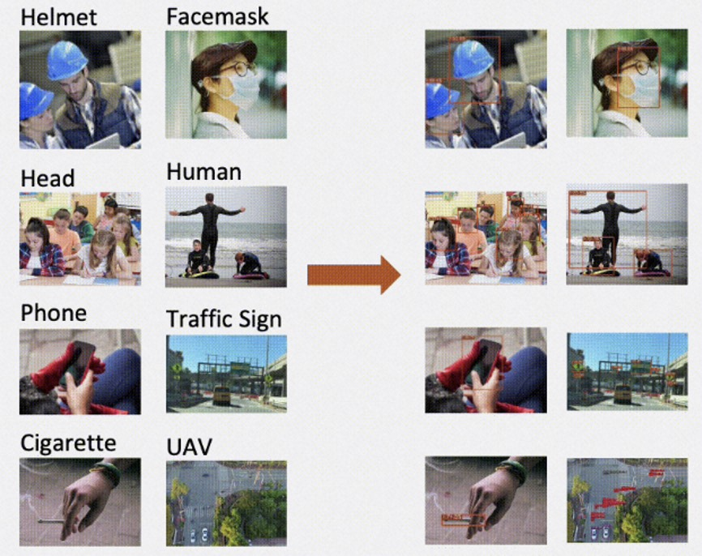
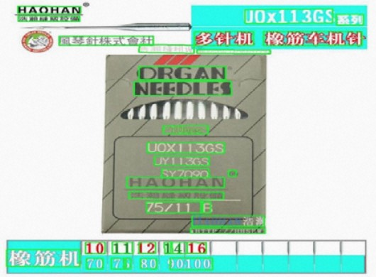
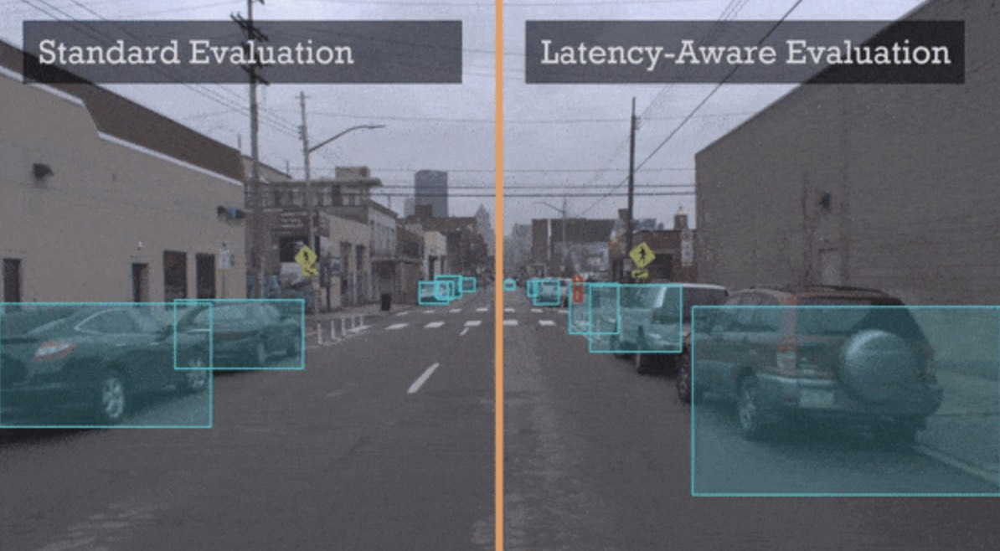
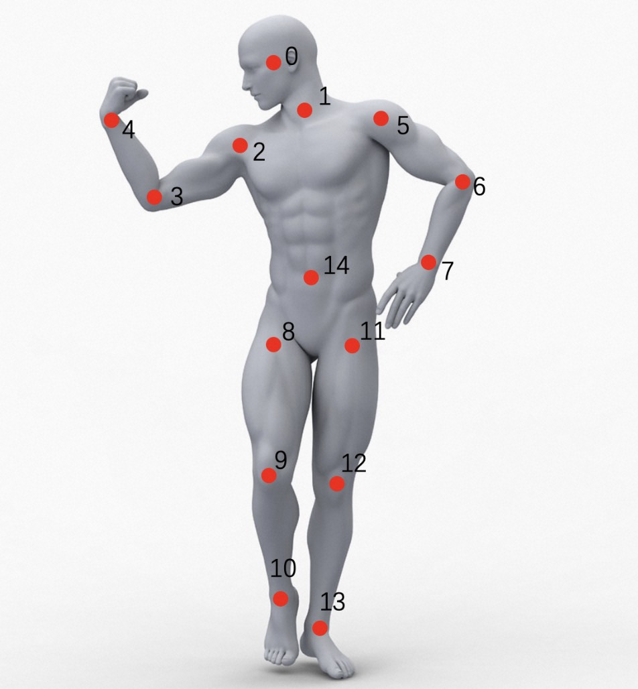
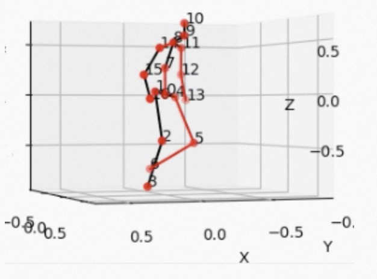

[简体中文](README.md) | English

# **AdaDet: A Development Toolkit for Object Detection based on [ModelScope](https://modelscope.cn/home)**

[](https://github.com/modelscope/adadet/blob/master/LICENSE)
[](https://github.com/modelscope/AdaDet/issues)
[](https://github.com/modelscope/AdaDet/stargazers)
[](./CONTRIBUTING.md)

## 🌈Introduction
AdaDet is an object detection development toolkit based on ModelScope. Users can experience cutting-edge models and solutions with simple commands.

## 🎁Supported Models and Solutions

|[General Object Detection](./docs/models/object_detection_EN.md)|[Domain Specific Object Detection](./docs/models/domain_specific_object_detection_EN.md)|[Small Ojbect Detection](./docs/models/small_object_detection_EN.md)|
|:---:|:---:|:---:|
| | | |
|[Face Detection](./docs/models/face_detection_EN.md)|[OCR](./docs/models/ocr_detection_EN.md)|[Video Object Detection](./docs/models/video_object_detection_EN.md)|
| | | |
|[2D Keypoint Detection](./docs/models/2d_keypoints_EN.md)|[3D Keypoint Detection](./docs/models/3d_keypoints_EN.md)|[Video Object Tracking](./docs/models/video_object_tracking_EN.md)|
| | | |
| [MOT & Counting](./docs/deploy/human/mot_counting_deploy_EN.md) | [Smoking Detection](./docs/deploy/security/smoke_det_deploy_EN.md) | [Break-in Detection](./docs/deploy/human/break_in_deploy_EN.md) |
| | | |
|[Face Retouch](./docs/deploy/human/face_retouch_deploy_EN.md)|||
||||

## 🔑Library Features

### 🎈Out-Of-The-Box Experience
Run models and industrial solutions using a one-line command.

### 🎈Various SOTA Models
AdaDet supports various SOTA models, covering series of object detection, keypoint detection, and so on.

## 🍗What's NEW
March 31, 2023 AdaDet v1.0.0 released!

## 🔧Environment Setup
[Installation Tutorial](./docs/install_EN.md).

## ⚡️Quick Start
[Quick Start Tutorial](./docs/quick_start_EN.md)

## ⏩Main Functions

### 📍Industrial Solutions
Each industrial solution contains several model nodes and post-processing nodes, which enables users to quickly develop and experience industrial applications.
#### 📌Run Industrial Solutions
Execute [run_deploy.sh](./tools/run_deploy.sh) script to get the performance of industrial solutions.
```bash
sh tools/run_deploy.sh
```
Click [link](https://modelscope.cn/studios/jp_lan/cv_maasdet_test/summary) to experience industrial solution demos.

Tutorial docs of supported industrial solutions:
- [MOT & Counting](./docs/deploy/human/mot_counting_deploy_EN.md)
- [Break-in Detection](./docs/deploy/human/break_in_deploy_EN.md)
- [Smoking Detection](./docs/deploy/security/smoke_det_deploy_EN.md)
- [Face Retouch](./docs/deploy/human/face_retouch_deploy_EN.md)

#### 📌Benchmark
Execute [run_benchmark.sh](./tools/run_benchmark.sh) script to obtain the inference time of industrial solution.
```bash
sh tools/run_benchmark.sh
```
More details can be found in [benchmark tutorial](./docs/benchmark/benchmark_tutorial_EN.md).

### 📍Models
For each supported model, AdaDet provides corresponding infer and train/eval functions for users to quickly develop their own models.

#### 📌Model Infer
Execute [run_infer.sh](./tools/run_infer.sh) script to get the model results.
```bash
sh tools/run_infer.sh
```
More details and a supported model list can be found in [infer tutorial](./docs/infer/infer_tutorial_EN.md).

Supported methods and papers
||||
|:----:|:----:|:----:|
|[General Object Detection](./docs/models/object_detection_EN.md)|[Domain Specific Object Detection](./docs/models/domain_specific_detection_EN.md)|[Few-shot Object Detection](./docs/models/small_object_detection_EN.md)|
|[Face Detection](./docs/models/face_detection_EN.md)|[OCR](./docs/models/ocr_detection_EN.md)|[Video Object detection](./docs/models/video_object_detection_EN.md)|
|[2D Keypoints Detection](./docs/models/2d_keypoints_EN.md)|[3D Keypoints Detection](./docs/models/3d_keypoints_EN.md)|[Video Object Tracking](./docs/models/video_object_tracking_EN.md)|

#### 📌Model Train/Eval
Train/Eval function can be used in the finetuning stage.

❗️Attention: Train/Eval function can only perform on GPU machines.

Execute [run_train.sh](./tools/run_train.sh) script to train a model.
```bash
sh tools/run_train.sh
```
Also, execute [run_eval.sh](./tools/run_eval.sh) script to evaluate a model.
```bash
sh tools/run_eval.sh
```
Tutorials of models which support train/eval function can be found in the [folder](./docs/train/).

## 🚴‍♀️CONTRIBUTING
All contributions are welcome to improve AdaDet. Please refer to [CONTRIBUTING.md](./CONTRIBUTING.md) for the contributing guideline.

## ⚠️License
This project is licensed under the [Apache License (Version 2.0)](./LICENSE).

## 📝Citation
```
@misc{AdaDet2023,
title={AdaDet: A Development Toolkit for Object Detection based on ModelScope},
author={AdaDet Authors},
howpublished = {\url{https://github.com/ModelScope/AdaDet}},
year={2023}
}
```
