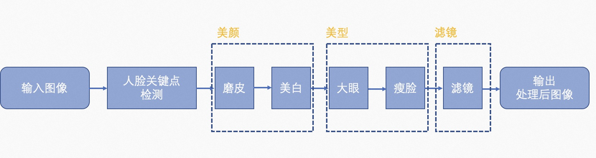

简体中文 | [English](./face_retouch_deploy_EN.md)
# 互动娱乐场景解决方案
此解决方案采用了人脸关键点检测和人脸美颜处理模块实现人脸特效（包括美颜、美型、滤镜）功能。
## 解决方案介绍
解决方案整体流程图如下：



整个解决方案使用了人脸关键点检测算法基于[cv_mobilenet_face-2d-keypoints_alignment](https://modelscope.cn/models/damo/cv_mobilenet_face-2d-keypoints_alignment/summary)进行106人脸关键点检测，获得人脸关键点后会经过[人脸美颜模块](../../adadet/deploy/face_retouch_deploy.py)实现人脸特效功能。
## 配置文件
互动娱乐解决方案可以通过[配置文件](../../../configs/deploy/human//face_retouch_deploy.yaml)进行参数配置，主要配置参数说明如下：
```yaml
input_path:
  'test/data/images/face_retouch_1.png'

output_path:
  ./deploy_res

vis_flag:
  True

adadet_deploy:
  type: FaceRetouch
  model_id: 'damo/cv_mobilenet_face-2d-keypoints_alignment'
  rules:
    is_video: False
    filter_style: 'none'      # 滤镜风格,范围['none', 'sun', 'marshmallow', 'magic', 'film', 'japan']
    smooth: 60                # 磨皮力度，范围[0, 100]
    white: 60                 # 美白力度，范围[0, 100]
    enlarge_eye: 36           # 大眼力度，范围[0, 100]
    slim_face: 50             # 瘦脸力度，范围[0, 100]
```

### 参数说明

对配置文件中的参数说明如下：

- `input_path` (str): 输入图像路径。
- `output_path` (str): 输出目录路径，存放推理结果、可视化结果等文件。
- `vis_flag` (bool): 输入对处理后进行可视化。
- `deploy`: 解决方案主要配置参数部分
- `type` (str): 方案的类别名称，无需改动。
- `model_id` (str): 人脸关键点检测模型对应的ModelScope模型id。
    + `rules`: 人脸美颜输入参数设置
        * `is_video` (bool): 输入是否为视频。
        * `filter_style` (str): 滤镜风格,范围['none', 'sun', 'marshmallow', 'magic', 'film', 'japan']。
        * `smooth` (int): 磨皮力度，范围[0, 100]。
        * `white` (int): 美白力度，范围[0, 100]。
        * `enlarge_eye` (int): 大眼力度，范围[0, 100]。
        * `slim_face` (int): 瘦脸力度，范围[0, 100]。


### 返回结果

解决方案返回结果的格式如下：
返回处理后的图像，格式和大小同输入图像。

## 性能评估
该解决方案在NVIDIA V100 GPU(16G)、32 core Xeon CPU上性能如下表：

| 场景化方案名称 | 模型体积 |
| :---: | :---: |
| 美颜特效 | 0.266427 M |


## ⚡️快速开始
使用下面命令可快速跑通该解决方案：
```python
python tools/deploy.py --config configs/deploy/human/face_retouch_deploy.yaml
```
