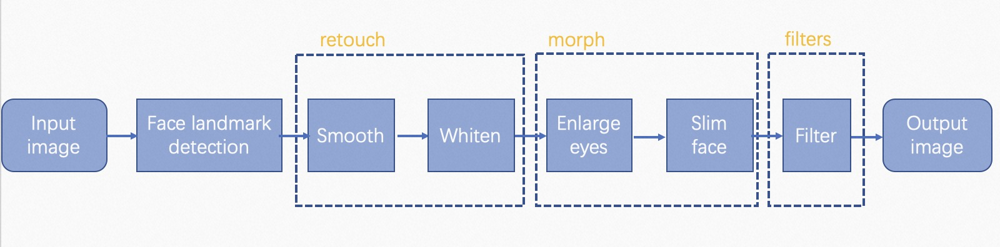

[简体中文](./face_retouch_deploy.md) | English
# Industrial Solution -- interactive entertainment
The solution aims to do face-retouch(include face retouch, face morph, filter) by face landmark detection and face retouch modules in series.
## Introduction
The pipeline of this solution is illustrated as:



The module of face landmark detection perform face keypoints detections based on [cv_mobilenet_face-2d-keypoints_alignment](https://modelscope.cn/models/damo/cv_mobilenet_face-2d-keypoints_alignment/summary), and then the results will be passed into the module of [face retouch](../../adadet/deploy/face_retouch_deploy.py) to process.

## Configurations
[configuration file eaxmple](../../../configs/deploy/human//face_retouch_deploy.yaml)，

for example:

```yaml
input_path:
  'test/data/images/face_retouch_1.png'

output_path:
  ./deploy_res

vis_flag:
  True

adadet_deploy:
  type: FaceRetouch
  model_id: 'damo/cv_mobilenet_face-2d-keypoints_alignment'
  rules:
    is_video: False
    filter_style: 'none'      # filter style, options ['none', 'sun', 'marshmallow', 'magic', 'film', 'japan']
    smooth: 60                # strength of smooth，range [0, 100]
    white: 60                 # strength of white [0, 100]
    enlarge_eye: 36           # strength of enlarge eyes，range [0, 100]
    slim_face: 50             # strength of slim face，range [0, 100]
```

### Parameters

statement of the parameters:

- `input_path` (str): Input image path。
- `output_path` (str): Output path for files including inference results and visualization results.
- `vis_flag` (bool): whether to show the detection results.
- `deploy`: specific parameters for this solution.
- `type` (str): default, type of the solution.
- `model_id` (str): ModelScope ID of face_2d_keypoints model.
    + `rules`: parameters of face retouch.
        * `is_video` (bool): whether the input is a video or image
        * `filter_style` (str): filter style, options ['none', 'sun', 'marshmallow', 'magic', 'film', 'japan'].
        * `smooth` (int): strength of smooth，range [0, 100].
        * `white` (int): strength of white [0, 100].
        * `enlarge_eye` (int): strength of enlarge eyes，range [0, 100].
        * `slim_face` (int): strength of slim face，range [0, 100].
```


### Returns

return face-retouch-processed image。

## Performance Evaluation
The performance evaluation on NVIDIA V100 GPU(16G)、32 core Xeon CPU:

| Solution | Model Size |
| :---: | :---: |
| face-retouch |  0.266427 M |

## ⚡️Quick-Start
Inference for this solution：
```python
python tools/deploy.py --config configs/deploy/human/face_retouch_deploy.yaml
```
