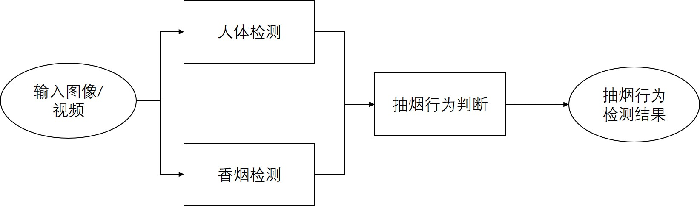

简体中文 | [English](./smoke_det_deploy_EN.md)
# 抽烟检测场景解决方案
此解决方案采用了人体检测、香烟检测和抽烟判断模块实现抽烟行为检测。

## 解决方案介绍
解决方案整体流程图如下：



整个解决方案使用了[实时人体检测模型](https://modelscope.cn/models/damo/cv_tinynas_human-detection_damoyolo/summary)进行人体检测，使用[实时香烟检测模型](https://modelscope.cn/models/damo/cv_tinynas_object-detection_damoyolo_cigarette/summary)进行香烟检测，获得人体检测结果和香烟检测结果后后会经过抽烟判断模块，最终检测出图片中的抽烟行为。

## 配置文件
抽烟检测解决方案可以通过[配置文件](../../../configs/deploy/security/smoke_det_deploy.yaml)进行参数配置，主要配置参数说明如下：
```yaml
input_path:
  ./tmp/smoke_a388.jpg

output_path:
  ./infer_res

vis_flag: False

adadet_deploy:
  type: SmokeDetection
  model_id:
      human_det: 'damo/cv_tinynas_human-detection_damoyolo'
      cigarette_det: 'damo/cv_tinynas_object-detection_damoyolo_cigarette'
  rules:
    is_video: False
    frame_rate: 1
    type: 'ioa'
    threshold: 0.5
```

### 参数说明

对配置文件中的参数说明如下：

- `input_path` (str): 输入图片/视频路径。
- `output_path` (str): 输出目录路径，存放日志、推理结果、可视化结果等文件。
- `vis_flag` (bool): 输入对检测结果进行可视化。
- `deploy`: 解决方案主要配置参数部分
    + `type` (str): 方案的类别名称，无需改动。
    + `model_id.human_det` (str): 人体检测模型对应的ModelScope模型id。
    + `model_id.cigarette_det` (str): 香烟检测模型对应的ModelScope模型id。
    + `rules`: 抽烟检测规则
        * `is_video` (bool): 输入是否为视频。
        * `frame_rate` (int): 抽帧的检测，只有在`is_video==True`时生效，比如：5表示间隔5帧抽取一帧进行处理。
        * `type` (str): 抽烟行为的判断方式，包括："ioa", "iou", "dist"三种方式。
        * `threshold` (float): 不同的抽烟方式对应的阈值，当香烟与人体的衡量值大于/小于（"dist"为小于，其它为大于）该阈值时，判定为抽烟。


### 返回结果

解决方案返回结果的格式如下：

```python

{
    0: { # 第0帧的检测结果，如果输入为图片，只有第0帧结果
        "human_res":{ # 人体检测结果，字段格式与ModelScope人体检测模型一致
            "scores": [float, float, ...], # 每个检测结果的置信度
            "labels": [str, str, ...], # 每个检测结果的类别
            "boxes": [[float, float, float, float], ...] # 每个检测结果的坐标信息，[x1, y1, x2, y2]
        },
        "cigs_res": {  # 香烟检测结果，字段格式与ModelScope人体检测模型一致
            "scores": [float, float, ...], # 每个检测结果的置信度
            "labels": [str, str, ...], # 每个检测结果的类别
            "boxes": [[float, float, float, float], ...] # 每个检测结果的坐标信息，[x1, y1, x2, y2]
        },
        "smoke_res": { # 抽烟行为检测结果，"scores", "labels", "boxes"字段与人体检测一致，增加了"smoke"字段
            "scores": [float, float, ...], # 每个检测结果的置信度
            "labels": [str, str, ...], # 每个检测结果的类别
            "boxes": [[float, float, float, float], ...], # 每个检测结果的坐标信息，[x1, y1, x2, y2]
            "smoke": [
                    {"flag": False, "cigs": None}, # 对应的人无抽烟行为
                    {"flag": True, "cigs": {'score': float, 'box': [float, float, float, float]},  # 对应的人有抽烟行为，"cigs"字段为匹配的香烟检测结果
                    ...]
        }
    },
    1: {
        ...
    },
    ...
}

```


## 性能评估
该解决方案在NVIDIA V100 GPU(16G)、32 core Xeon CPU上性能如下表：

| 场景化方案名称 | 每帧使用耗时 | 模型体积 |
| :---: | :---: | :---: |
| 抽烟检测 | 61.13ms | 130M |

## ⚡️快速开始
使用下面命令可快速跑通该解决方案：
```python
python tools/deploy.py --config configs/deploy/security/smoke_det_deploy.yaml
```

## 二次开发
本场景化方案中，支持二次开发（单模型训练）的模型为：

1. 人体检测模型，具体的二次开发流程可参考对应的[训练文档](../../train/detection/damoyolo_trainer.md)。
2. 香烟检测模型，具体的二次开发流程可参考对应的[训练文档](../../train/detection/damoyolo_trainer.md)。
