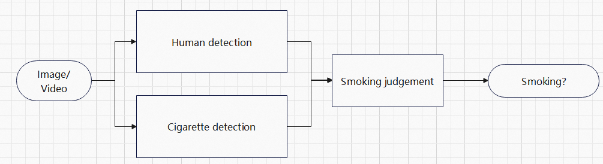

[简体中文](./smoke_det_deploy.md) | English
# Industrial Solution -- Smoking Detection
This solution is assembled with the modules of human detection, cigarette detection and smoking judgement to detect the smoking behavior.

## Introduction
The pipeline of this solution is illustrated as:



In this solution, human body is firstly detected by [real-time human detection model](https://modelscope.cn/models/damo/cv_tinynas_human-detection_damoyolo/summary), and in parallel, cigarette is detected by [real-time cigarette detection](https://modelscope.cn/models/damo/cv_tinynas_object-detection_damoyolo_cigarette/summary). Finally, the human body and cigarette detection results will be passed into the module of smoking judgement to detect the smoking behavior.

## Configurations
[configuration file eaxmple](../../../configs/deploy/security/smoke_det_deploy.yaml)
```yaml
input_path:
  ./tmp/smoke_a388.jpg

output_path:
  ./infer_res

vis_flag: False

adadet_deploy:
  type: SmokeDetection
  model_id:
      human_det: 'damo/cv_tinynas_human-detection_damoyolo'
      cigarette_det: 'damo/cv_tinynas_object-detection_damoyolo_cigarette'
  rules:
    is_video: False
    frame_rate: 1
    type: 'ioa'
    threshold: 0.5
```

### Parameters
- `input_path` (str): Input image/video path
- `output_path` (str): Output path for files including inference results and visualization results
- `vis_flag` (bool): whether to show the detection results
- `deploy`: specific parameters for this solution
    + `type` (str): default, type of the solution
    + `model_id.human_det` (str): ModelScope ID of human detection model
    + `model_id.cigarette_det` (str): ModelScope ID of cigarette detection model
    + `rules`: rules for smoking detection
        * `is_video` (bool): whether the input is a video or not
        * `frame_rate` (int): frame extraction rate for detection, valid when `is_video==True`, e.g. 5 represents that one frame is extracted at intervals of 5
        * `type` (str): smoking judgement methods: "ioa", "iou", "dist"
        * `threshold` (float): threshold for smoking judgement, smoking detected based on the comparison between the value of the judgement method and the threshold (for "dist", less than threshold, while for "ioa" and "iou", more than threshold)


### Returns

```python
{
    0: { # detection result of frame 0. If the input is an image, only return the result of frame 0
        "human_res":{ # human detection results, same as ModelScope
            "scores": [float, float, ...], # confidences of detected boxes
            "labels": [str, str, ...], # labels of detected boxes
            "boxes": [[float, float, float, float], ...] # coordinates of detected boxes，[x1, y1, x2, y2]
        },
        "cigs_res": {  # cigarette detection results, same as ModelScope
            "scores": [float, float, ...], # confidences of detected boxes
            "labels": [str, str, ...], # labels of detected boxes
            "boxes": [[float, float, float, float], ...] # coordinates of detected boxes，[x1, y1, x2, y2]
        },
        "smoke_res": { # smoking detection results，"scores", "labels", "boxes" same as human detection results，add the key of "smoke"
            "scores": [float, float, ...], # confidences of detected boxes
            "labels": [str, str, ...], # labels of detected boxes
            "boxes": [[float, float, float, float], ...], # coordinates of detected boxes，[x1, y1, x2, y2]
            "smoke": [
                    {"flag": False, "cigs": None}, # smoking not detected for this person
                    {"flag": True, "cigs": {'score': float, 'box': [float, float, float, float]},  # smoking detected for this person，the value of "cigs" represents corresponding coordinates of detected cigarette
                    ...]
        }
    },
    1: {
        ...
    },
    ...
}

```


## Performance Evaluation
The performance evaluation on NVIDIA V100 GPU(16G)、32 core Xeon CPU:

| Solution | Inference time (single frame) | Model Size |
| :---: | :---: | :---: |
| smoking detection | 61.13ms | 130M |

## ⚡️Quick-Start
Inference for this solution：
```python
python tools/deploy.py --config configs/deploy/security/smoke_det_deploy.yaml
```

## Finetune/Customize your model
For this solution, you can finetune/customize your model with specific datasets.

1. Human detection model: fine-tuning this model, please refer to [training docs](../../train/detection/damoyolo_trainer_EN.md) for details.
2. Cigarette detection model: fine-tuning this model, please refer to [training docs](../../train/detection/damoyolo_trainer_EN.md) for details.
